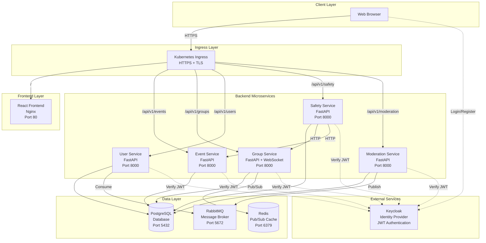
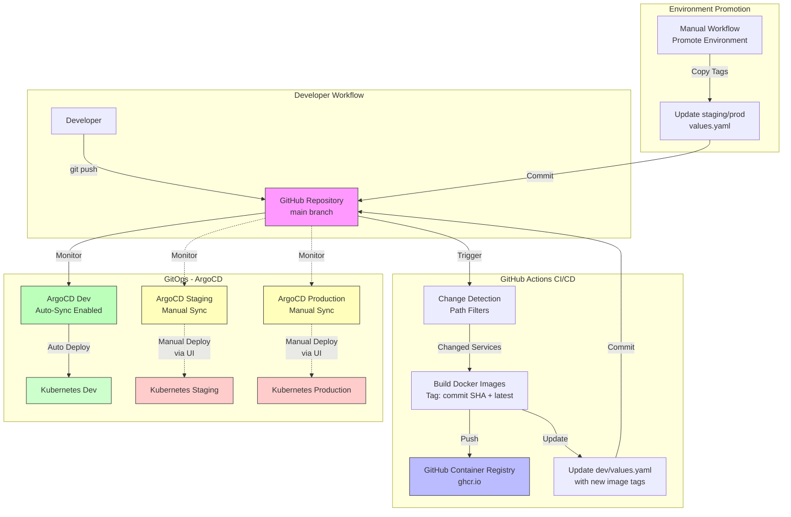
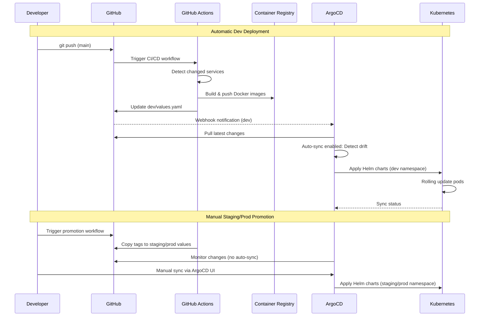
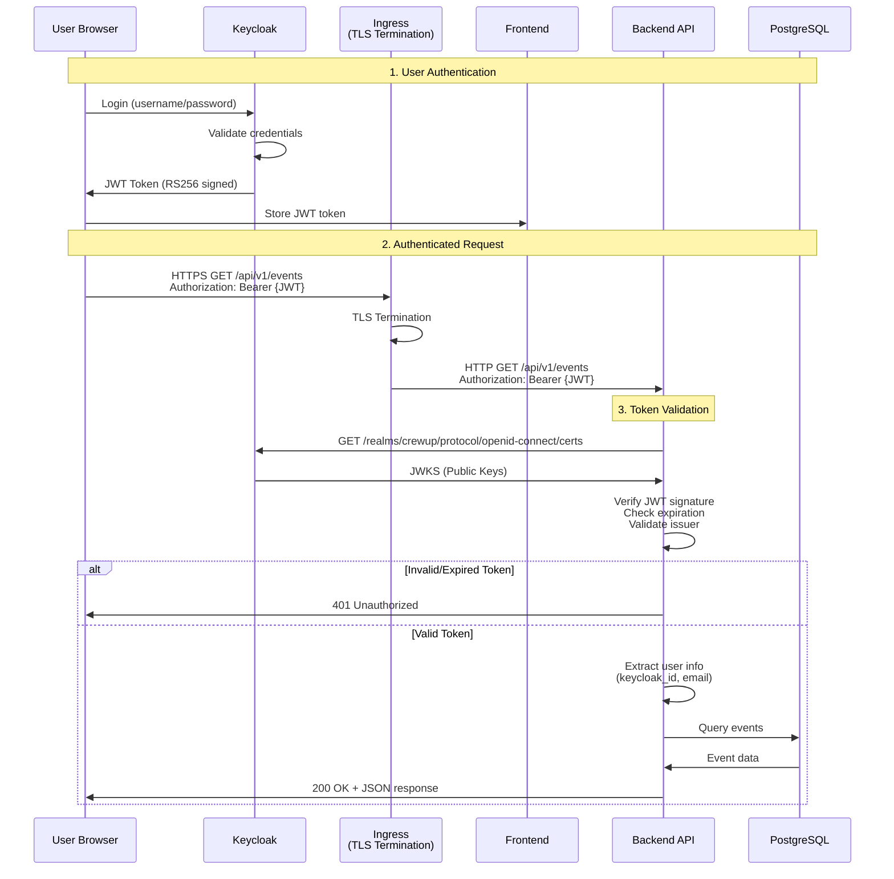
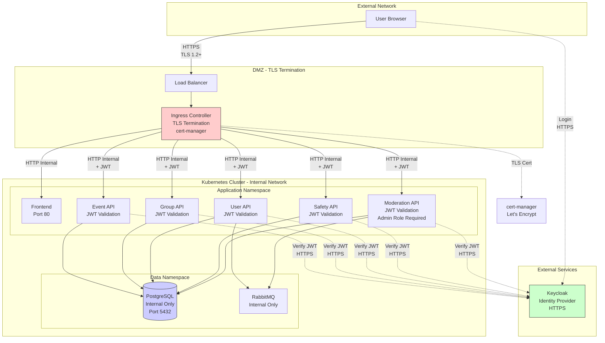
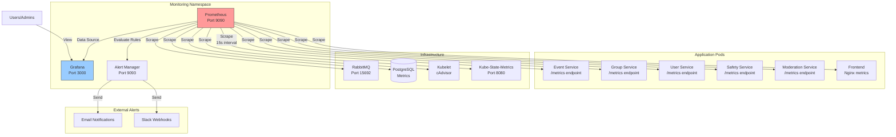
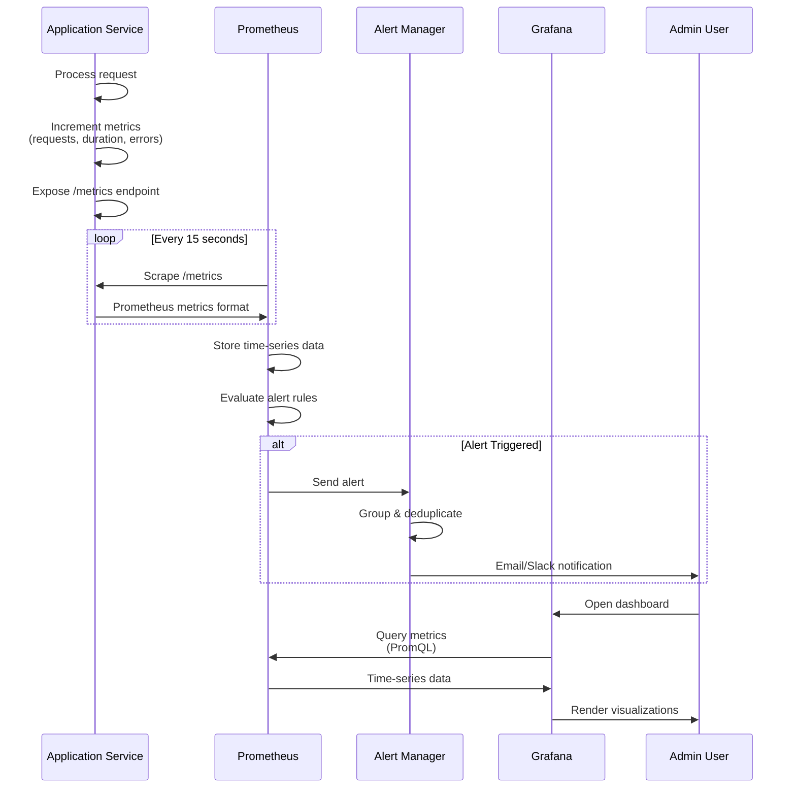

# CrewUp System Architecture

## Table of Contents
1. [Microservices Architecture](#1-microservices-architecture)
2. [GitOps CI/CD Pipeline](#2-gitops-cicd-pipeline)
3. [Security Model and Request Flow](#3-security-model-and-request-flow)
4. [Monitoring and Observability](#4-monitoring-and-observability)

---

## 1. Microservices Architecture

### Overview

CrewUp is built using a microservices architecture with 6 backend services, 1 frontend application, and supporting infrastructure components.

### System Components

#### Backend Microservices (FastAPI/Python)

1. **Event Service** - Manages events
   - Create, read, update, delete events
   - Event discovery and search
   - Location-based queries
   - Port: 8000

2. **Group Service** - Handles groups and membership
   - Group creation and management
   - Member management (join/leave)
   - WebSocket support for real-time chat
   - Port: 8000

3. **User Service** - User profile management
   - User registration from Keycloak
   - Profile CRUD operations
   - RabbitMQ consumer for moderation events
   - Port: 8000

4. **Safety Service** - Emergency alert system
   - Safety alert creation
   - Alert broadcasting to groups
   - Location tracking for emergencies
   - Port: 8000

5. **Moderation Service** - Content moderation
   - User ban/unban functionality
   - Moderation actions published to RabbitMQ
   - Admin operations
   - Port: 8000

6. **Frontend** - React SPA
   - User interface
   - Interactive maps
   - Real-time chat interface
   - Event and group discovery
   - Port: 80 (Nginx)

#### Infrastructure Components

7. **PostgreSQL** - Relational database
   - Shared database for all services
   - Complex schema with relationships
   - Geospatial support
   - Port: 5432

8. **RabbitMQ** - Message broker
   - Asynchronous communication
   - Moderation events (user bans)
   - Decouples services
   - Ports: 5672 (AMQP), 15672 (Management)

9. **Redis** - In-memory data store
   - WebSocket message synchronization (Pub/Sub)
   - Enables horizontal scaling of chat service
   - Multi-pod real-time communication
   - Port: 6379

10. **Keycloak** - Identity and access management
    - User authentication
    - JWT token issuance
    - SSO across services
    - External service

### Communication Patterns

#### Synchronous Communication (HTTP/REST)
- Frontend to Backend: REST API calls via Ingress
- Service to Service: Direct HTTP calls (e.g., Safety Service calling Group/Event Services)

#### Asynchronous Communication (RabbitMQ)
- Moderation Service publishes user ban events
- User Service consumes moderation events

#### Real-Time Communication (WebSocket)
- Group Service provides WebSocket endpoint for chat
- Frontend connects for real-time messaging
- **Redis Pub/Sub** synchronizes messages across multiple pods for horizontal scaling

### Architecture Diagram



---

## 2. GitOps CI/CD Pipeline

### Overview

CrewUp uses a GitOps approach with GitHub Actions for CI/CD and ArgoCD for continuous deployment to Kubernetes.

### Pipeline Stages

#### 1. Code Push to GitHub
Developer pushes code to `main` branch

#### 2. Change Detection (GitHub Actions)
- Detects which services have changed using path filters
- Only builds and deploys modified services
- Prevents unnecessary builds

#### 3. Build and Push (GitHub Actions)
- Builds Docker images for changed services
- Tags images with:
  - Git commit SHA (e.g., `abc1234`)
  - `latest` tag
- Pushes to GitHub Container Registry (ghcr.io)

#### 4. Update Environment Values (GitHub Actions)
- Updates `environments/dev/values.yaml` with new image tags
- Commits changes back to repository
- Triggers ArgoCD sync

#### 5. ArgoCD Synchronization
- Monitors repository for changes
- Detects updated values.yaml
- Applies changes to Kubernetes cluster
- Performs rolling updates

#### 6. Environment Promotion
- Manual workflow to promote between environments
- Promotion path: `dev` → `staging` → `production`
- Copies image tags from source to target environment

### Environments

1. **Development (dev)**
   - Image tags automatically updated on every push to main (via GitHub Actions)
   - ArgoCD auto-sync enabled - deploys automatically
   - URL: `https://crewup-dev.ltu-m7011e-3.se`

2. **Staging**
   - Image tags promoted from dev via manual GitHub Actions workflow
   - ArgoCD manual sync required - deployment via ArgoCD UI
   - URL: `https://crewup-staging.ltu-m7011e-3.se`

3. **Production**
   - Image tags promoted from staging via manual GitHub Actions workflow
   - ArgoCD manual sync required - deployment via ArgoCD UI
   - URL: `https://crewup.ltu-m7011e-3.se`

### CI/CD Pipeline Diagram



### GitOps Workflow Detail



### Key Features

- **Automated Dev Deployments**: Dev environment auto-deploys on every merge via ArgoCD auto-sync
- **Manual Staging/Production Deployments**: Controlled releases to staging and production via ArgoCD UI
- **GitOps Principles**: Git as single source of truth for all environments
- **Self-Healing (Dev)**: ArgoCD automatically corrects manual changes in dev namespace
- **Rollback Capability**: Easy rollback via Git revert or ArgoCD UI
- **Multi-Environment**: Separate dev/staging/production with promotion workflow
- **Selective Builds**: Only build changed services (efficiency)

---

## 3. Security Model and Request Flow

### Authentication Architecture

CrewUp uses Keycloak as a centralized identity provider with JWT-based authentication.

#### Components

1. **Keycloak** - Identity Provider
   - User registration and login
   - JWT token issuance (RS256 signed)
   - Token refresh
   - SSO across all services

2. **Frontend** - Token Management
   - Stores JWT in browser (localStorage/sessionStorage)
   - Includes token in Authorization header
   - Handles token refresh

3. **Backend Services** - Token Validation
   - Each service independently validates JWT
   - Fetches Keycloak JWKS (JSON Web Key Set)
   - Verifies signature, expiration, issuer
   - Extracts user claims (email, name, sub)

### Secure Request Flow



### Security Layers

#### 1. Transport Layer Security (TLS)
- All external traffic uses HTTPS
- TLS certificates managed by cert-manager
- Automatic certificate renewal via Let's Encrypt

#### 2. Authentication (Keycloak + JWT)
- Centralized authentication
- Stateless JWT tokens
- RS256 asymmetric signing
- Token expiration and refresh

#### 3. Authorization
- User ownership verification
- Role-based access (user/admin/moderator)
- Group membership checks
- Private group access control

#### 4. Network Security
- Kubernetes Network Policies
- Service-to-service communication within cluster
- Ingress as single entry point
- Database not exposed externally

### Security Architecture Diagram



### JWT Token Flow

1. **User Login**
   - User provides credentials to Keycloak
   - Keycloak validates and issues JWT token
   - Token contains claims: sub (user ID), email, name, roles

2. **Token Storage**
   - Frontend stores token securely
   - Included in Authorization header for all API requests

3. **Token Validation (per service)**
   - Extract token from Authorization header
   - Fetch Keycloak JWKS (cached)
   - Verify signature using public key
   - Validate expiration, issuer, audience
   - Extract user information from claims

4. **Authorization**
   - Check if user has permission for action
   - Verify resource ownership
   - Check role requirements (admin, moderator)

### Security Best Practices Implemented

- HTTPS/TLS for all external communication
- JWT tokens for stateless authentication
- RS256 asymmetric signing (not HS256)
- Token expiration and refresh
- Database credentials in Kubernetes Secrets
- Network isolation (database not externally accessible)
- Input validation with Pydantic models
- SQL injection prevention via ORM (SQLAlchemy)
- CORS configuration

---

## 4. Monitoring and Observability

### Overview

CrewUp implements comprehensive monitoring using Prometheus for metrics collection and Grafana for visualization.

### Monitoring Stack Components

#### 1. Prometheus
- Time-series database
- Metrics collection from all services
- Alert rule evaluation
- Data retention and storage

#### 2. Grafana
- Visualization dashboards
- Real-time metrics display
- Alerting and notifications
- Data source integration with Prometheus

#### 3. Prometheus Instrumentator
- FastAPI integration library
- Automatic HTTP metrics
- Request duration, count, errors
- Integrated in all backend services

#### 4. Kube-State-Metrics
- Kubernetes cluster metrics
- Pod, deployment, node status
- Resource utilization

### Metrics Collection

#### Application Metrics (per service)
- **HTTP Requests**: Request count, duration, status codes
- **API Endpoints**: Per-endpoint metrics
- **Business Metrics**:
  - User registrations
  - Event creations
  - Group formations
  - Messages sent
  - Safety alerts triggered

#### Infrastructure Metrics
- **Container Metrics** (cAdvisor):
  - CPU usage per container
  - Memory usage per container
  - Network I/O
  - Disk I/O

- **Node Metrics** (Kubelet):
  - Node CPU and memory
  - Disk usage
  - Network traffic

- **Kubernetes Metrics** (kube-state-metrics):
  - Pod status and restarts
  - Deployment replica count
  - Service availability

- **RabbitMQ Metrics**:
  - Queue depth
  - Message rate
  - Consumer count
  - Connection status

- **PostgreSQL Metrics**:
  - Connection count
  - Query performance
  - Database size
  - Transaction rate

### Monitoring Architecture



### Prometheus Scraping Configuration

```yaml
scrape_configs:
  # Application pods with annotation
  - job_name: 'kubernetes-pods'
    kubernetes_sd_configs:
      - role: pod
    relabel_configs:
      - source_labels: [__meta_kubernetes_pod_annotation_prometheus_io_scrape]
        action: keep
        regex: true

  # RabbitMQ
  - job_name: 'rabbitmq'
    static_configs:
      - targets: ['rabbitmq-service-api.rabbitmq.svc.cluster.local:15692']

  # Kubernetes infrastructure
  - job_name: 'kubernetes-nodes'
  - job_name: 'kubernetes-cadvisor'
  - job_name: 'kube-state-metrics'
```

### Grafana Dashboards

#### 1. Microservices Health Dashboard
- Request rate per service
- Error rate (4xx, 5xx)
- Response time (p50, p95, p99)
- Service uptime

#### 2. Infrastructure Dashboard
- Node CPU and memory usage
- Pod status and restarts
- Network traffic
- Disk utilization

#### 3. Application Metrics Dashboard
- User registrations over time
- Active users
- Events created
- Messages sent
- Safety alerts

#### 4. Database Dashboard
- PostgreSQL connections
- Query performance
- Database size growth
- Table statistics

### Logging Strategy

While the system currently focuses on metrics, logging is implemented at multiple levels:

#### Application Logs
- Structured logging with Python logging module
- Log levels: DEBUG, INFO, WARNING, ERROR, CRITICAL
- Contextual information (user ID, request ID)
- Captured by Kubernetes (stdout/stderr)

#### Potential Log Aggregation (Future)
- ELK Stack (Elasticsearch, Logstash, Kibana)
- Loki + Grafana
- Centralized log storage and search

### Tracing Strategy

#### Current Implementation
- Request correlation via headers
- Service-to-service call tracking
- Error propagation

#### Potential Distributed Tracing (Future)
- OpenTelemetry integration
- Jaeger or Zipkin
- End-to-end request tracing across microservices
- Performance bottleneck identification

### Alert Rules

Prometheus alert rules configured for:

- **High Error Rate**: >5% of requests returning 5xx
- **Service Down**: Health check failures
- **High Latency**: p99 latency >2 seconds
- **Pod Crashes**: Multiple pod restarts
- **Resource Exhaustion**: High CPU/memory usage
- **Database Issues**: Connection pool exhaustion
- **Message Queue Backlog**: RabbitMQ queue depth >1000

### Monitoring Data Flow



### Key Metrics Tracked

#### HTTP Metrics (per service)
- `http_requests_total` - Total HTTP requests
- `http_request_duration_seconds` - Request duration histogram
- `http_requests_in_progress` - Active requests

#### Business Metrics
- `users_registered_total` - Total user registrations
- `events_created_total` - Total events created
- `groups_created_total` - Total groups created
- `safety_alerts_total` - Total safety alerts

#### Infrastructure Metrics
- `container_cpu_usage_seconds_total` - CPU usage
- `container_memory_usage_bytes` - Memory usage
- `kube_pod_status_phase` - Pod health status
- `rabbitmq_queue_messages` - Queue depth

### Observability Benefits

1. **Proactive Issue Detection**: Alerts before users report problems
2. **Performance Optimization**: Identify slow endpoints
3. **Capacity Planning**: Track resource usage trends
4. **Debugging**: Correlate issues across services
5. **Business Insights**: Track user behavior and system usage
6. **SLA Monitoring**: Ensure service level agreements are met

---

## Summary

The CrewUp architecture demonstrates:

1. **Scalable Microservices**: Independent services with clear boundaries
2. **Modern CI/CD**: GitOps with automated deployment and promotion
3. **Enterprise Security**: JWT authentication, TLS encryption, network isolation
4. **Comprehensive Monitoring**: Metrics, dashboards, and alerting

This architecture enables the system to handle growing user loads, maintain high availability, and provide insights into system health and performance.
