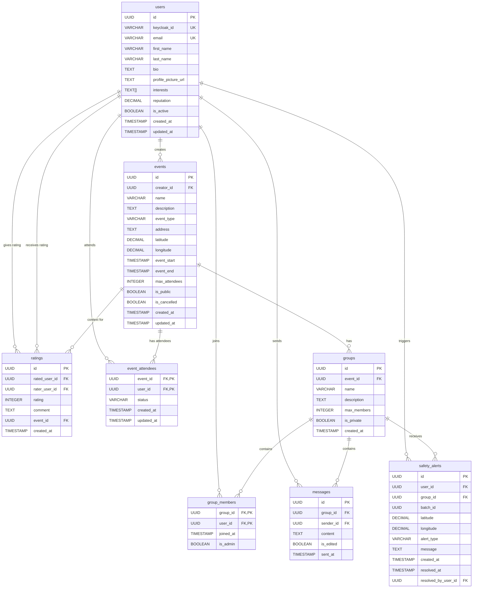
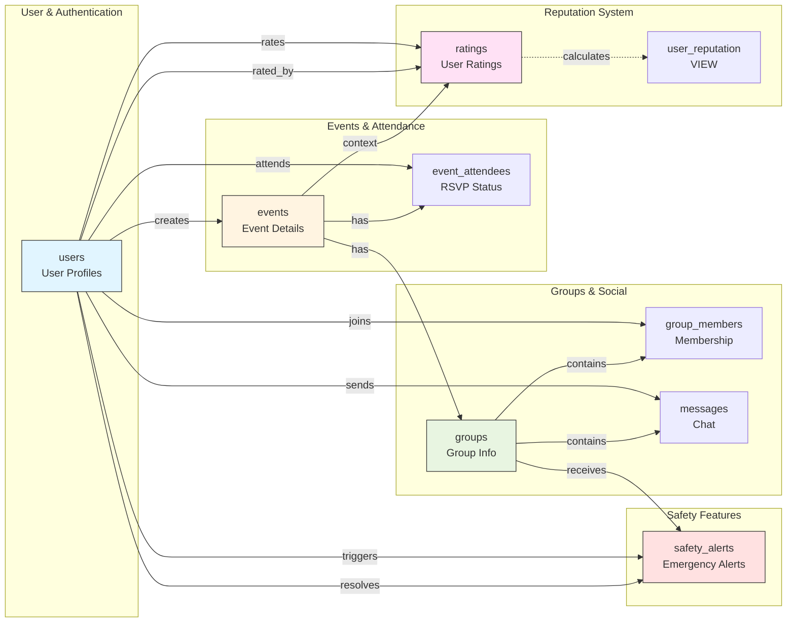

# CrewUp Database Schema

## Overview

CrewUp uses a PostgreSQL relational database with a comprehensive schema designed to support all features of the platform. The database is shared across all microservices, providing a centralized data store with strong consistency guarantees.

## Database Technology

- **Database**: PostgreSQL 15
- **ORM**: SQLAlchemy (Python)
- **Migrations**: SQL schema initialization
- **Extensions**: UUID (uuid-ossp) for primary keys

## Entity Relationship Diagram



## Detailed Table Schemas

### 1. users

Stores user profile information synchronized from Keycloak.

| Column | Type | Constraints | Description |
|--------|------|-------------|-------------|
| id | UUID | PRIMARY KEY | Auto-generated user ID |
| keycloak_id | VARCHAR(255) | UNIQUE, NOT NULL | User ID from Keycloak |
| email | VARCHAR(255) | UNIQUE, NOT NULL | User email address |
| first_name | VARCHAR(100) | NOT NULL | User's first name |
| last_name | VARCHAR(100) | NOT NULL | User's last name |
| bio | TEXT | | User biography/description |
| profile_picture_url | TEXT | | URL to profile picture |
| interests | TEXT[] | | Array of user interests |
| reputation | DECIMAL(3,2) | DEFAULT 0.00, CHECK (0-5) | Average user rating |
| is_active | BOOLEAN | DEFAULT TRUE | Account active status |
| created_at | TIMESTAMP | DEFAULT NOW() | Account creation time |
| updated_at | TIMESTAMP | DEFAULT NOW() | Last update time |

**Indexes**:
- `idx_users_email` on email
- `idx_users_keycloak_id` on keycloak_id
- `idx_users_reputation` on reputation

### 2. events

Stores event information (parties, concerts, gatherings, etc.).

| Column | Type | Constraints | Description |
|--------|------|-------------|-------------|
| id | UUID | PRIMARY KEY | Auto-generated event ID |
| creator_id | UUID | FOREIGN KEY → users(id) | Event creator |
| name | VARCHAR(255) | NOT NULL | Event name |
| description | TEXT | | Event description |
| event_type | VARCHAR(50) | CHECK (enum values) | Type: bar, club, concert, etc. |
| address | TEXT | NOT NULL | Event address |
| latitude | DECIMAL(10,8) | | GPS latitude |
| longitude | DECIMAL(11,8) | | GPS longitude |
| event_start | TIMESTAMP WITH TIME ZONE | NOT NULL | Event start time |
| event_end | TIMESTAMP WITH TIME ZONE | | Event end time |
| max_attendees | INTEGER | CHECK (> 0) | Maximum attendees |
| is_public | BOOLEAN | DEFAULT TRUE | Public visibility |
| is_cancelled | BOOLEAN | DEFAULT FALSE | Cancellation status |
| created_at | TIMESTAMP | DEFAULT NOW() | Creation time |
| updated_at | TIMESTAMP | DEFAULT NOW() | Last update time |

**Constraints**:
- `event_start > created_at` (event must be in future)
- `event_end > event_start` (if end is specified)

**Indexes**:
- `idx_events_start` on event_start
- `idx_events_creator` on creator_id
- `idx_events_location` on (latitude, longitude)
- `idx_events_type` on event_type

**Event Types**: bar, club, concert, party, restaurant, outdoor, sports, other

### 3. groups

Groups formed for specific events.

| Column | Type | Constraints | Description |
|--------|------|-------------|-------------|
| id | UUID | PRIMARY KEY | Auto-generated group ID |
| event_id | UUID | FOREIGN KEY → events(id) | Associated event |
| name | VARCHAR(255) | NOT NULL | Group name |
| description | TEXT | | Group description |
| max_members | INTEGER | DEFAULT 10, CHECK (> 0) | Max group size |
| is_private | BOOLEAN | DEFAULT FALSE | Private group flag |
| created_at | TIMESTAMP | DEFAULT NOW() | Creation time |

**Indexes**:
- `idx_groups_event` on event_id

### 4. group_members

Junction table for group membership.

| Column | Type | Constraints | Description |
|--------|------|-------------|-------------|
| group_id | UUID | PRIMARY KEY, FOREIGN KEY → groups(id) | Group reference |
| user_id | UUID | PRIMARY KEY, FOREIGN KEY → users(id) | User reference |
| joined_at | TIMESTAMP | DEFAULT NOW() | Join timestamp |
| is_admin | BOOLEAN | DEFAULT FALSE | Admin privileges |

**Composite Primary Key**: (group_id, user_id)

**Indexes**:
- `idx_group_members_group` on group_id
- `idx_group_members_user` on user_id

### 5. messages

Chat messages within groups.

| Column | Type | Constraints | Description |
|--------|------|-------------|-------------|
| id | UUID | PRIMARY KEY | Auto-generated message ID |
| group_id | UUID | FOREIGN KEY → groups(id) | Group reference |
| sender_id | UUID | FOREIGN KEY → users(id) | Message sender |
| content | TEXT | NOT NULL, CHECK (1-2000 chars) | Message content |
| is_edited | BOOLEAN | DEFAULT FALSE | Edit flag |
| sent_at | TIMESTAMP | DEFAULT NOW() | Send time |

**Constraints**:
- Message length: 1-2000 characters

**Indexes**:
- `idx_messages_group_sent` on (group_id, sent_at)

### 6. ratings

User ratings given after events.

| Column | Type | Constraints | Description |
|--------|------|-------------|-------------|
| id | UUID | PRIMARY KEY | Auto-generated rating ID |
| rated_user_id | UUID | FOREIGN KEY → users(id) | User being rated |
| rater_user_id | UUID | FOREIGN KEY → users(id) | User giving rating |
| rating | INTEGER | NOT NULL, CHECK (1-5) | Rating value (1-5 stars) |
| comment | TEXT | | Optional comment |
| event_id | UUID | FOREIGN KEY → events(id) | Event context |
| created_at | TIMESTAMP | DEFAULT NOW() | Rating time |

**Constraints**:
- UNIQUE (rated_user_id, rater_user_id, event_id) - One rating per user per event
- `rated_user_id != rater_user_id` - No self-rating

**Indexes**:
- `idx_ratings_rated_user` on rated_user_id

### 7. safety_alerts

Emergency alerts triggered by users.

| Column | Type | Constraints | Description |
|--------|------|-------------|-------------|
| id | UUID | PRIMARY KEY | Auto-generated alert ID |
| user_id | UUID | FOREIGN KEY → users(id) | User triggering alert |
| group_id | UUID | FOREIGN KEY → groups(id) | Target group |
| batch_id | UUID | | Links alerts to multiple groups |
| latitude | DECIMAL(10,8) | | User location (latitude) |
| longitude | DECIMAL(11,8) | | User location (longitude) |
| alert_type | VARCHAR(50) | DEFAULT 'help', CHECK (enum) | Type of emergency |
| message | TEXT | | Optional message |
| created_at | TIMESTAMP | DEFAULT NOW() | Alert time |
| resolved_at | TIMESTAMP | | Resolution time |
| resolved_by_user_id | UUID | FOREIGN KEY → users(id) | Resolver |

**Alert Types**: help, medical, harassment, other

**Indexes**:
- `idx_safety_alerts_group` on group_id
- `idx_safety_alerts_user` on user_id
- `idx_safety_alerts_created` on created_at
- `idx_safety_alerts_batch` on batch_id

### 8. event_attendees

RSVP status for event attendance.

| Column | Type | Constraints | Description |
|--------|------|-------------|-------------|
| event_id | UUID | PRIMARY KEY, FOREIGN KEY → events(id) | Event reference |
| user_id | UUID | PRIMARY KEY, FOREIGN KEY → users(id) | User reference |
| status | VARCHAR(20) | DEFAULT 'going', CHECK (enum) | RSVP status |
| created_at | TIMESTAMP | DEFAULT NOW() | RSVP time |
| updated_at | TIMESTAMP | DEFAULT NOW() | Last update |

**Composite Primary Key**: (event_id, user_id)

**RSVP Status Values**: going, interested, not_going

**Indexes**:
- `idx_event_attendees_user` on user_id
- `idx_event_attendees_status` on (event_id, status)

## Views

### user_reputation

Calculated view for user reputation statistics.

```sql
CREATE VIEW user_reputation AS
SELECT
    u.id AS user_id,
    COALESCE(AVG(r.rating), 0) AS average_rating,
    COUNT(r.id) AS total_ratings
FROM users u
LEFT JOIN ratings r ON u.id = r.rated_user_id
GROUP BY u.id;
```

## Triggers

### Auto-Update Timestamps

Automatically updates `updated_at` timestamp on record modification.

```sql
CREATE OR REPLACE FUNCTION set_updated_at()
RETURNS TRIGGER AS $$
BEGIN
  NEW.updated_at = CURRENT_TIMESTAMP;
  RETURN NEW;
END;
$$ LANGUAGE plpgsql;

CREATE TRIGGER trg_users_updated
BEFORE UPDATE ON users
FOR EACH ROW
EXECUTE FUNCTION set_updated_at();

CREATE TRIGGER trg_events_updated
BEFORE UPDATE ON events
FOR EACH ROW
EXECUTE FUNCTION set_updated_at();
```

## Database Access Patterns

### By Microservice

| Service | Primary Tables | Access Pattern |
|---------|----------------|----------------|
| Event | events, event_attendees | CRUD events, manage attendees |
| Group | groups, group_members, messages | CRUD groups, manage members, chat |
| User | users | CRUD user profiles, sync from Keycloak |
| Safety | safety_alerts, groups, events | Create alerts, resolve alerts |
| Moderation | users | Ban/unban users |

## Relationships Summary

### One-to-Many Relationships

- **users → events**: One user creates many events
- **users → ratings (as rater)**: One user gives many ratings
- **users → ratings (as rated)**: One user receives many ratings
- **users → messages**: One user sends many messages
- **users → safety_alerts**: One user creates many alerts
- **events → groups**: One event has many groups
- **groups → messages**: One group contains many messages
- **groups → safety_alerts**: One group receives many alerts

### Many-to-Many Relationships

- **users ↔ groups** (via group_members): Users can join multiple groups, groups have multiple members
- **users ↔ events** (via event_attendees): Users can attend multiple events, events have multiple attendees

### Self-Referential Relationships

- **ratings**: users rate other users (rater → rated)
- **safety_alerts**: users can resolve others' alerts (resolved_by_user_id)

## Data Integrity

### Foreign Key Constraints

All foreign keys are configured with appropriate cascade behaviors:

- **ON DELETE CASCADE**: When a parent record is deleted, child records are deleted
  - Users deleted → their events, ratings, messages deleted
  - Events deleted → associated groups, attendees deleted
  - Groups deleted → members, messages deleted

- **ON DELETE SET NULL**: When parent deleted, foreign key set to NULL
  - User deleted → safety_alerts.resolved_by_user_id = NULL

### Check Constraints

- **Rating values**: 1-5 (inclusive)
- **Reputation values**: 0.00-5.00 (inclusive)
- **Message length**: 1-2000 characters
- **Event timing**: start > created_at, end > start
- **No self-rating**: rated_user_id ≠ rater_user_id
- **Positive integers**: max_attendees > 0, max_members > 0

### Unique Constraints

- **users.keycloak_id**: One Keycloak user = one CrewUp profile
- **users.email**: One email per account
- **ratings(rated_user_id, rater_user_id, event_id)**: One rating per user pair per event
- **group_members(group_id, user_id)**: One membership record per user per group
- **event_attendees(event_id, user_id)**: One RSVP per user per event

## Indexing Strategy

### Performance Optimization

Indexes are created on:

1. **Foreign Keys**: All foreign keys indexed for join performance
2. **Lookup Fields**: email, keycloak_id for user lookup
3. **Sorting Fields**: created_at, sent_at, event_start for time-based queries
4. **Geospatial**: (latitude, longitude) for location-based searches
5. **Filtering**: event_type, reputation for common filters
6. **Composite**: (group_id, sent_at), (event_id, status) for complex queries

## Schema Visualization



## Design Decisions

### UUID Primary Keys
- Globally unique across distributed systems
- Prevents enumeration attacks
- Better for microservices architecture

### Shared Database
- Strong consistency across services
- ACID transactions
- Simpler than distributed data management
- Trade-off: Tight coupling between services

### Soft Deletes
- `is_active` flag for users
- `is_cancelled` flag for events
- Preserves data integrity and history

### Denormalization
- `reputation` stored in users table (calculated from ratings)
- Updated via trigger or periodic job
- Improves read performance at cost of consistency

### Timestamp Tracking
- `created_at` on all tables for auditing
- `updated_at` on mutable tables for change tracking
- Automatic update via triggers

## Future Enhancements

Potential schema improvements:

1. **Soft Deletes**: Add `deleted_at` timestamp instead of hard deletes
2. **Audit Logs**: Track all changes to critical tables
3. **Search Optimization**: Full-text search indexes for event/group names
4. **Partitioning**: Partition large tables (messages, safety_alerts) by time
5. **Read Replicas**: Separate read/write workloads for scalability
6. **Separate Databases**: Move to database-per-service for better isolation

## Connection Information

### Local Development
- **Host**: localhost
- **Port**: 5432
- **Database**: crewup
- **User**: crewup
- **Password**: crewup_dev_password

### Production (Kubernetes)
- **Host**: postgres-service.app.svc.cluster.local
- **Port**: 5432
- **Credentials**: Stored in Kubernetes Secrets

## Backup and Recovery

### Backup Strategy
- Daily automated backups
- Retention: 30 days
- Point-in-time recovery enabled

### Disaster Recovery
- Regular backup testing
- Documented restore procedures
- RTO (Recovery Time Objective): 1 hour
- RPO (Recovery Point Objective): 24 hours
